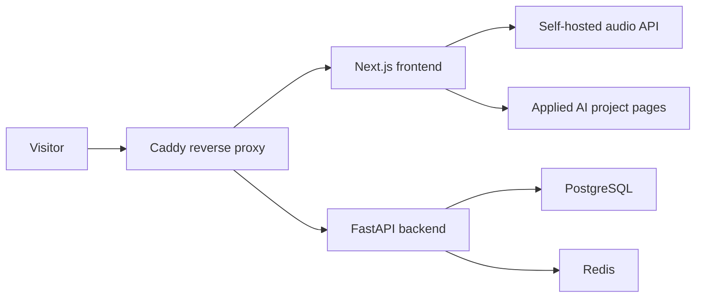

# Selfsite Monorepo

Language: **English** | [中文](README.zh-CN.md)

Selfsite is the deployment shell for a personal Applied AI portfolio: a Next.js frontend, FastAPI backend, PostgreSQL/Redis data layer, and Caddy reverse proxy.

## Architecture



## Portfolio Metrics

Self-hosted app baseline targets. These should be re-measured on the actual VPS/domain after deployment.

| Metric | Current portfolio baseline | Measurement note |
| --- | ---: | --- |
| Latency | Homepage target `< 1.5s LCP` | Docker Compose local/proxy path target |
| RAG hit rate | `N/A` | Portfolio shell has no retrieval layer |
| Agent success rate | `N/A` | Project showcase, not an agent runtime |
| Report generation time | `N/A` | No report generation workflow |
| Cost | `~$5-$10 / month` | Typical small VPS + domain/proxy hosting estimate |

## Stack

- Frontend: Next.js + TypeScript
- Backend: FastAPI
- Data: PostgreSQL + Redis
- Proxy: Caddy
- Orchestration: Docker Compose

## Run With Docker Compose

```bash
cp .env.example .env
docker compose up --build
```

Open:

- Site: `http://localhost:8080`
- API health: `http://localhost:8080/api/v1/health`

## Local Development

Start database and Redis:

```bash
docker compose up -d db redis
```

Start backend from `backend/` and frontend from `frontend/` with their local dev commands.

## Self-Hosted Audio Player

If `NEXT_PUBLIC_AUDIO_SOURCE` is set, the homepage uses that audio URL. Otherwise it reads local files from `LOCAL_AUDIO_DIR` and exposes them through `/api/audio` and `/api/audio/tracks`.
