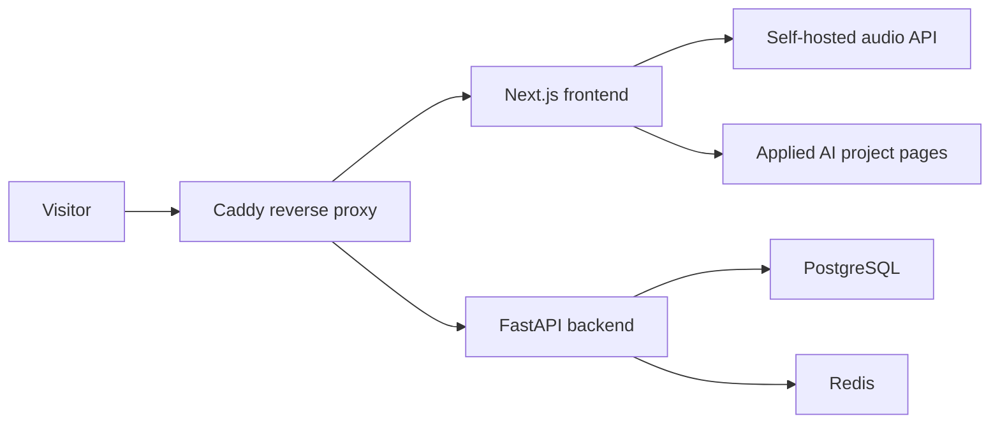
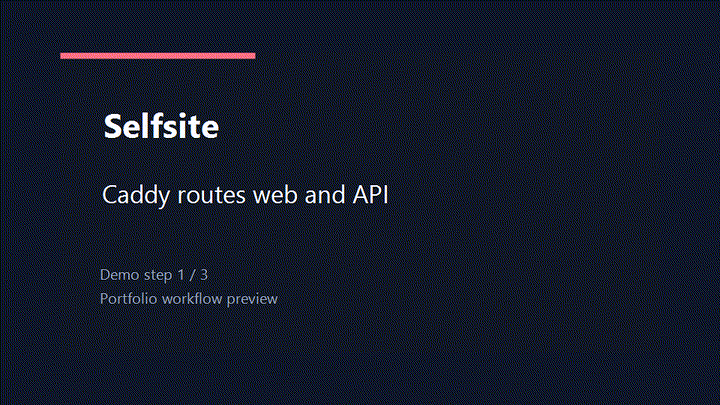

# Selfsite Monorepo

Selfsite is the deployment shell for a personal Applied AI portfolio: a Next.js frontend, FastAPI backend, PostgreSQL/Redis data layer, and Caddy reverse proxy.

## Architecture



## Demo GIF



## Portfolio Metrics

Self-hosted app baseline targets. These should be re-measured on the actual VPS/domain after deployment.

| Metric | Current portfolio baseline | Measurement note |
| --- | ---: | --- |
| Latency | Homepage target `< 1.5s LCP` | Docker Compose local/proxy path target |
| RAG hit rate | `N/A` | Portfolio shell has no retrieval layer |
| Agent success rate | `N/A` | Project showcase, not an agent runtime |
| Report generation time | `N/A` | No report generation workflow |
| Cost | `~$5-$10 / month` | Typical small VPS + domain/proxy hosting estimate |

## Stack

- Frontend: Next.js + TypeScript
- Backend: FastAPI
- Data: PostgreSQL + Redis
- Proxy: Caddy
- Orchestration: Docker Compose

## Prerequisites

- Docker Desktop or a Docker daemon with Compose support
- Node.js 22.x recommended for local frontend development
- Python 3.12+

Avoid Node.js 24 for local Next.js development in this repo. On Windows it can fail to load the SWC binary used by Next.js.

## Directory Responsibilities

- `frontend/`: Next.js app runtime code and UI
- `backend/`: FastAPI app runtime code and API modules
- `docs/`: cross-lane contracts, architecture notes, QA reports
- `docker-compose.yml`: local multi-service orchestration
- `Caddyfile`: reverse proxy rules (`/api` -> backend, others -> frontend)
- `.env.example`: required environment variables for all services

## Environment Setup

1. Create your local env file:

```bash
cp .env.example .env
```

PowerShell:

```powershell
Copy-Item .env.example .env
```

## Run With Docker Compose

1. Build and start all services:

```bash
docker compose up --build
```

2. Open:

- Site: `http://localhost:8080`
- API health (via proxy): `http://localhost:8080/api/v1/health`
- Backend direct health: `http://localhost:8000/health`

3. Stop:

```bash
docker compose down
```

## Local Development Path

1. Start PostgreSQL and Redis only:

```bash
docker compose up -d db redis
```

2. Start backend (from `backend/`):

```bash
python -m venv .venv
source .venv/bin/activate
pip install -r requirements.txt
python -m uvicorn app.main:app --reload --host 0.0.0.0 --port 8000
```

PowerShell:

```powershell
python -m venv .venv
.\.venv\Scripts\Activate.ps1
python -m pip install -r requirements.txt
python -m uvicorn app.main:app --reload --host 0.0.0.0 --port 8000
```

3. Start frontend (from `frontend/`):

```bash
npm install
npm run dev
```

PowerShell:

```powershell
npm.cmd install
npm.cmd run dev
```

4. Open:

- Frontend dev server: `http://localhost:3000`
- Backend direct health: `http://localhost:8000/health`

## Self-Hosted Audio Player

If `NEXT_PUBLIC_AUDIO_SOURCE` is set, the homepage will use that explicit audio URL.

If `NEXT_PUBLIC_AUDIO_SOURCE` is empty, the homepage will:

- read songs from `LOCAL_AUDIO_DIR`
- expose them through `/api/audio` and `/api/audio/tracks`
- render a runtime playlist with:
  - play / pause
  - seek bar
  - mute button
  - previous / next
  - direct song switching

Default local music directory:

```env
LOCAL_AUDIO_DIR=D:\soundpadyy
```

In Docker Compose, that host directory is mounted into the frontend container as `/music`, so the playlist works in container mode too.

Use audio files you are allowed to host and play.

## Service Map

- `caddy` listens on `${CADDY_HTTP_PORT}` and routes traffic
- `frontend` listens on `3000` inside Docker network
- `backend` listens on `${BACKEND_PORT}` and is also exposed to host
- `db` persists data in `postgres_data` volume
- `redis` persists data in `redis_data` volume
