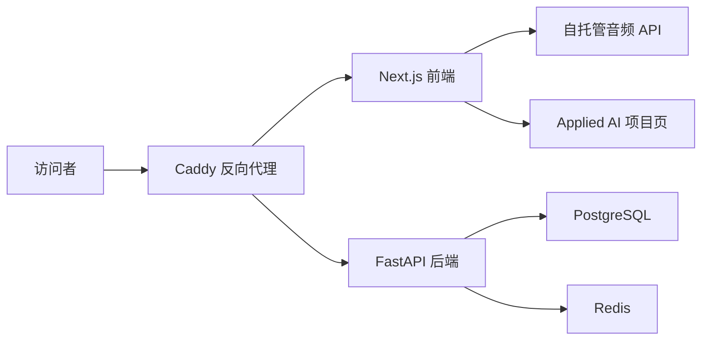

# Selfsite Monorepo

语言： [English](README.md) | **中文**

Selfsite 是个人 Applied AI 作品集的自托管部署外壳，包含 Next.js 前端、FastAPI 后端、PostgreSQL/Redis 数据层和 Caddy 反向代理。

## 架构



## 演示 GIF


## 作品集指标

自托管应用 baseline 目标；部署到真实 VPS/域名后需要重新测量。

| 指标 | 当前作品集 baseline | 说明 |
| --- | ---: | --- |
| 延迟 | 首页目标 `< 1.5s LCP` | Docker Compose 本地/代理路径目标 |
| RAG 命中率 | `N/A` | 作品集外壳没有检索层 |
| Agent 成功率 | `N/A` | 项目展示，不是 Agent runtime |
| 报告生成耗时 | `N/A` | 没有报告生成流程 |
| 成本 | `~$5-$10 / 月` | 小型 VPS + 域名/代理托管估算 |

## 技术栈

- 前端：Next.js + TypeScript
- 后端：FastAPI
- 数据：PostgreSQL + Redis
- 代理：Caddy
- 编排：Docker Compose

## Docker Compose 运行

```bash
cp .env.example .env
docker compose up --build
```

打开：

- 站点：`http://localhost:8080`
- API health：`http://localhost:8080/api/v1/health`

## 本地开发

启动数据库和 Redis：

```bash
docker compose up -d db redis
```

然后分别在 `backend/` 和 `frontend/` 中启动后端与前端开发服务。

## 自托管音频播放器

如果设置了 `NEXT_PUBLIC_AUDIO_SOURCE`，首页会使用该音频 URL。否则会从 `LOCAL_AUDIO_DIR` 读取本地音频，并通过 `/api/audio` 和 `/api/audio/tracks` 暴露播放列表。
